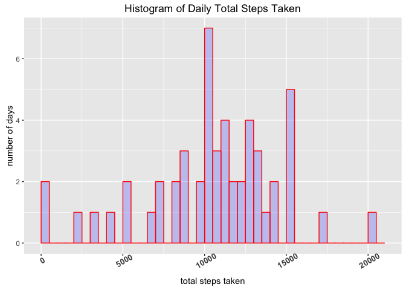
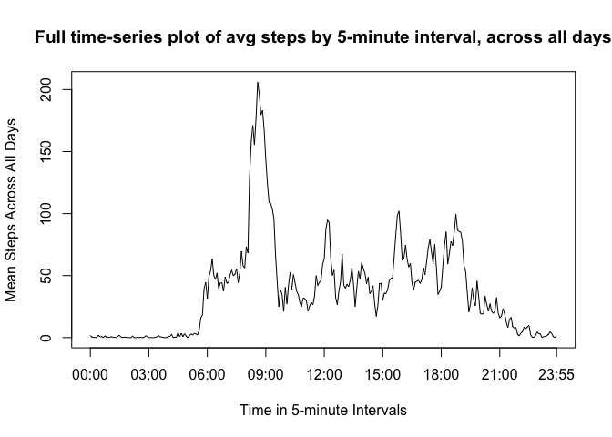
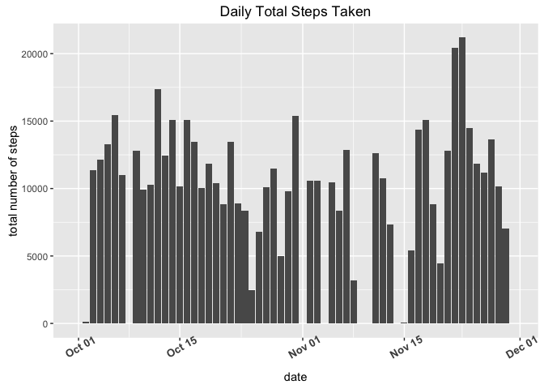
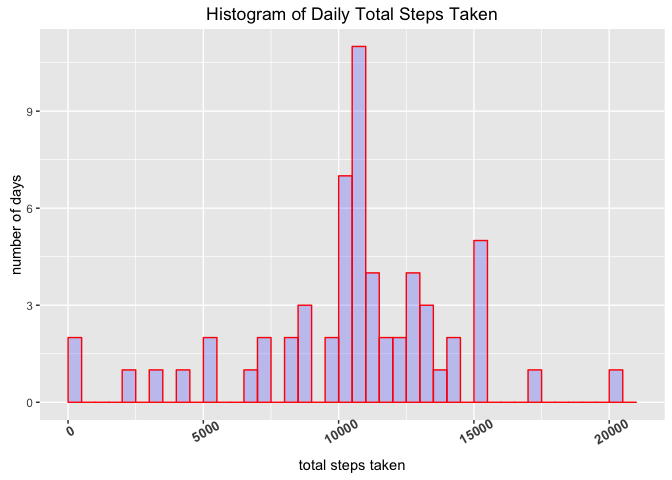
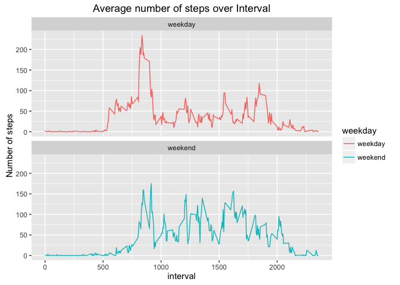

# Reproducible Research: Peer Assessment 1
The Data Agent MsDbl0Zero  
May 7, 2016  


#<span style="color:#808080">Introduction</span>
  
  It is now possible to collect a large amount of data about personal movement using activity monitoring devices such as a Fitbit, Nike Fuelband, or Jawbone Up. These type of devices are part of the “quantified self” movement – a group of enthusiasts who take measurements about themselves regularly to improve their health, to find patterns in their behavior, or because they are tech geeks. But these data remain under-utilized both because the raw data are hard to obtain and there is a lack of statistical methods and software for processing and interpreting the data.

  This assignment makes use of data from a personal activity monitoring device. This device collects data at 5 minute intervals through out the day. The data consists of two months of data from an anonymous individual collected during the months of October and November, 2012 and include the number of steps taken in 5 minute intervals each day.


```r
# Loading required libraries/packages
library(pacman)
p_load("dplyr","lubridate", "knitr", "ggplot2")
```

###<span style="color:#808080"> Loading and preprocessing the data</span>
The data can be found at this [link](https://d396qusza40orc.cloudfront.net/repdata%2Fdata%2Factivity.zip).
However, I have downloaded it for offline use for the project. Assume the data is at the current directory same as the source file.


```r
activity <- read.csv("activity.csv", header=TRUE)
fmt = "%Y-%m-%d"
activity$date <- as.POSIXct(strptime(
  x = as.character(activity$date), format = fmt))
```

- The date of the activity started at **2012-10-01**, ended at **2012-11-30**

###<span style="color:#808080"> What is mean total number of steps taken per day?</span>

```r
dailySteps = activity %>% group_by(date) %>%
  summarise(ttlDailySteps = sum(steps, na.rm=TRUE))
meanTtlStepsPerDay = colMeans(dailySteps[2]) # mean 
medianTtlStepsPerDay = median(dailySteps$ttlDailySteps)
```

- The __mean__ total number of step taken per day is **9354**
- The __median__ total number of step taken per day is **1.0395\times 10^{4}**

###<span style="color:#808080"> Histogram of the total number of steps taken each day</span>


```r
ggplot(dailySteps, aes(ttlDailySteps)) + 
  geom_histogram(breaks=seq(1, max(dailySteps$ttlDailySteps), by = 500),col="red",fill="blue", alpha = .2) +
    xlab("total steps taken") + ylab("number of days") +
    theme(axis.text.x = element_text(face="bold", size=10, angle=30)) + 
    ggtitle("Histogram of Daily Total Steps Taken")
```



###<span style="color:#808080"> What is the average daily activity pattern?</span>

- Calculate the average number of steps taken for each 5-minute interval, averaged across all days (y-axis), plot the time series. 


```r
intervalSteps = activity %>% group_by(interval) %>%
  summarise(avgStepsInterval = mean(steps, na.rm=TRUE))

ggplot(intervalSteps, aes(interval, avgStepsInterval)) + 
  geom_line() +
  xlab("interval(00:00 - 23:55)") + ylab("average number of steps") +
  theme(axis.text.x = element_text(face="bold", size=10, angle=30)) + 
  ggtitle("Average Steps Taken at Interval")
```



- The 5-minute Interval Containing the Maximum Number of Steps is :


```r
maxsteps <- summarise(intervalSteps, maxsteps=max(avgStepsInterval))
filter(intervalSteps, avgStepsInterval == maxsteps$maxsteps)
```

```
## Source: local data frame [1 x 2]
## 
##   interval avgStepsInterval
##      (int)            (dbl)
## 1      835         206.1698
```


- Out of curiosity, the following time series plot shows the total steps taken on each day. 


```r
ggplot(dailySteps, aes(date, ttlDailySteps)) + 
  geom_bar(stat="identity", position=position_dodge()) +
  xlab("date") + ylab("total number of steps") +
  theme(axis.text.x = element_text(face="bold", size=10, angle=30)) + 
  ggtitle("Daily Total Steps Taken")
```



###<span style="color:#808080"> Imputing missing values</span>

- The total number of missing values in the dataset (i.e. the total number of rows with 𝙽𝙰) is 2304

- To impute the missing values, we first clone a new dataset *activityFull* from the `activity` dataset, then replace the NA steps in the *activityFull* dataset with the ones found in intervalSteps with corresponding interval needed. A more complicated strategy can be using a 3-interval moving average (+1 and -1 interval) around the interval location need to be imputed, this may yield smoother results.


```r
activityFull <- activity # clone a new dataset
mvInd <- which(is.na(activity$steps)) #find the indices of the missing values
mvInt <- activity[mvInd,]$interval # find the intervals that needs imputed values for steps
for (i in 1:length(mvInd))# we can also do this using an "apply" function without using the for loop
  activityFull$steps[mvInd[i]] <- intervalSteps[which(intervalSteps$interval==mvInt[i]),2][[1]]
```

- Calculate and report the total number of the steps taken per day on the newly imputed dataset 

```r
dailySteps = activityFull %>% group_by(date) %>%
  summarise(ttlDailySteps = sum(steps))
meanTtlStepsPerDay = colMeans(dailySteps[2]) # mean 
medianTtlStepsPerDay = median(dailySteps$ttlDailySteps) #median
```

- The __mean__ total number of step taken per day is **1.0766\times 10^{4}**
- The __median__ total number of step taken per day is **1.0766\times 10^{4}**
We see they are identical, and they are different from the results in Part I exercise, why? Because when we impute the missing value, we are filling in the average accross all days for that interval, this yields *very* similar daily pattern accross all days, when aggregate over all days, the mediam and mean converge because the data is basically "smoothed". 

- Make a histogram plot below on this newly imputed dataset


```r
ggplot(dailySteps, aes(ttlDailySteps)) + 
  geom_histogram(breaks=seq(1, max(dailySteps$ttlDailySteps), by = 500),col="red",fill="blue", alpha = .2) +
  xlab("total steps taken") + ylab("number of days") +
  theme(axis.text.x = element_text(face="bold", size=10, angle=30)) + 
  ggtitle("Histogram of Daily Total Steps Taken")
```



###<span style="color:#808080"> Are there differences in activity patterns between weekdays and weekends?</span>

- To identify activity patterns between weekdays and weekends, we create a new factor variable in the dataset with two levels – “weekday” and “weekend” indicating whether a given date is a weekday or weekend day. Make a panel plot containing a time series plot of the 5-minute interval (x-axis) and the average number of steps taken, averaged across all weekday days or weekend days (y-axis). 
- We do see different patterns: on Weekdays, the activitys tend to be on the earlier side of the day, whereas on the weekends the activity happens throughout the day more evenly. So we might guess this individual has a daytime job that probably requires being still or less active.


```r
activity$weekday <- as.factor(ifelse(weekdays(activity$date) %in% c("Saturday", "Sunday"), "weekend", "weekday"))
# aggregate over the weekday and interval
patternToPlot <- activity %>% group_by(interval, weekday) %>%
  summarise(avgSteps = mean(steps, na.rm=TRUE))
ggplot(patternToPlot, aes(x=interval, y=avgSteps, fill=weekday)) +
  geom_line(aes(color=weekday)) +
  facet_wrap(~weekday,nrow=2) +
  ylab("Number of steps") +
  ggtitle("Average number of steps over Interval")
```




###<span style="color:red">Now you should get up, drink some water and walk around &#x1f603; Thank you!! </span>

